# Jarkom-Modul-2-I05-2023

## Modul 2 Jarkom 2023 I05 Formal Report

Group Members:
| No |  Name    |  NRP  |
| ---       |   ---     |---  |
|     1     |     Khairiya Maisa Putri    | 5025211192 |
|     2     |     Talitha Hayyinas Sahala    |  5025211263 |

Topologi number: 5

## Topologi
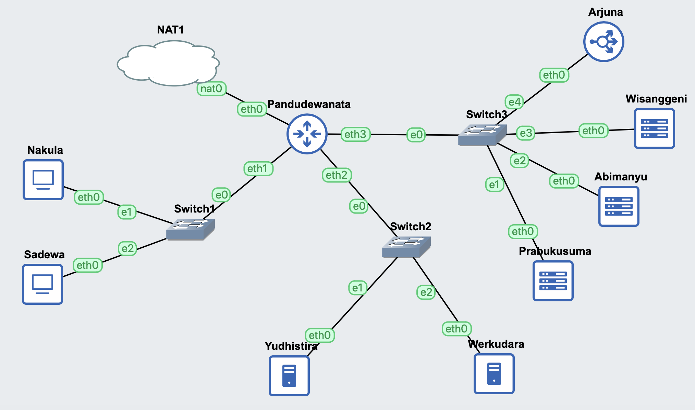

## Node Configuration

- Pandudewanata
```
auto eth0
iface eth0 inet dhcp

auto eth1
iface eth1 inet static
	address 10.61.1.1
	netmask 255.255.255.0

auto eth2
iface eth2 inet static
	address 10.61.2.1
	netmask 255.255.255.0

auto eth3
iface eth3 inet static
	address 10.61.3.1
	netmask 255.255.255.0
```
- Nakula
```
auto eth0
iface eth0 inet static
	address 10.61.1.2
	netmask 255.255.255.0
	gateway 10.61.1.1
```
- Sadewa
```
auto eth0
iface eth0 inet static
	address 10.61.1.3
	netmask 255.255.255.0
	gateway 10.61.1.1
```
- Yudhistira
```
auto eth0
iface eth0 inet static
	address 10.61.2.2
	netmask 255.255.255.0
	gateway 10.61.2.1
```
- Werkudara
```
auto eth0
iface eth0 inet static
	address 10.61.2.3
	netmask 255.255.255.0
	gateway 10.61.2.1
```
- Prabukusuma
```
auto eth0
iface eth0 inet static
	address 10.61.3.2
	netmask 255.255.255.0
	gateway 10.61.3.1
```
- Abimanyu
```
auto eth0
iface eth0 inet static
	address 10.61.3.3
	netmask 255.255.255.0
	gateway 10.61.3.1
```
- Wisanggeni
```
auto eth0
iface eth0 inet static
	address 10.61.3.4
	netmask 255.255.255.0
	gateway 10.61.3.1
```
- Arjuna
```
auto eth0
iface eth0 inet static
	address 10.61.3.5 
	netmask 255.255.255.0
	gateway 10.61.3.1
```

## Install and Setup
- Router (Pandudewanata)
```
iptables -t nat -A POSTROUTING -o eth0 -j MASQUERADE -s 10.55.0.0/16
echo 'nameserver 192.168.122.1' > /etc/resolv.conf
```

- DNS Master and Slave
```
echo 'nameserver 192.168.122.1' > /etc/resolv.conf
apt-get update
apt-get install bind9 -y      
```
- Client (Nakula and Sadewa)
```
echo '
nameserver 10.61.2.2 # IP Yudhistira
nameserver 10.61.2.3 # IP Werkudara
nameserver 192.168.122.1' > /etc/resolv.conf

apt-get update
apt-get install dnsutils -y
apt-get install lynx -y
```
- Web Server Nginx
```
apt install nginx php php-fpm -y
```
- Web Server Apache2
```
apt-get update
apt-get install dnsutils -y
apt-get install lynx -y
apt-get install nginx -y
service nginx start
apt-get install apache2 -y
apt-get install libapache2-mod-php7.0 -y
service apache2 start
apt-get install wget -y
apt-get install unzip -y
apt-get install php -y
echo -e "\n\nPHP Version:"
php -v
```
- Zip Download and Unzip Web Server Resources
```
wget -O '/var/www/abimanyu.I05.com' 'https://drive.usercontent.google.com/download?id=1a4V23hwK9S7hQEDEcv9FL14UkkrHc-Zc'
unzip -o /var/www/abimanyu.I05.com -d /var/www/
mv /var/www/abimanyu.yyy.com /var/www/abimanyu.I05
rm /var/www/abimanyu.I05.com
rm -rf /var/www/abimanyu.yyy.com

wget -O '/var/www/parikesit.abimanyu.I05.com' 'https://drive.usercontent.google.com/download?id=1LdbYntiYVF_NVNgJis1GLCLPEGyIOreS'
unzip -o /var/www/parikesit.abimanyu.I05.com -d /var/www/
mv /var/www/parikesit.abimanyu.yyy.com /var/www/parikesit.abimanyu.I05
rm /var/www/parikesit.abimanyu.I05.com
rm -rf /var/www/parikesit.abimanyu.yyy.com
mkdir /var/www/parikesit.abimanyu.I05/secret

wget -O '/var/www/rjp.baratayuda.abimanyu.I05.com' 'https://drive.usercontent.google.com/download?id=1pPSP7yIR05JhSFG67RVzgkb-VcW9vQO6'
unzip -o /var/www/rjp.baratayuda.abimanyu.I05.com -d /var/www/
mv /var/www/rjp.baratayuda.abimanyu.yyy.com /var/www/rjp.baratayuda.abimanyu.I05
rm /var/www/rjp.baratayuda.abimanyu.I05.com
rm -rf /var/www/rjp.baratayuda.abimanyu.yyy.com
```

# No. 1
## Question
> Yudhistira akan digunakan sebagai DNS Master, Werkudara sebagai DNS Slave, Arjuna merupakan Load Balancer yang terdiri dari beberapa Web Server yaitu Prabakusuma, Abimanyu, dan Wisanggeni.
## Solution
Test whether the nodes are working or not
```
ping google.com -c 3
```
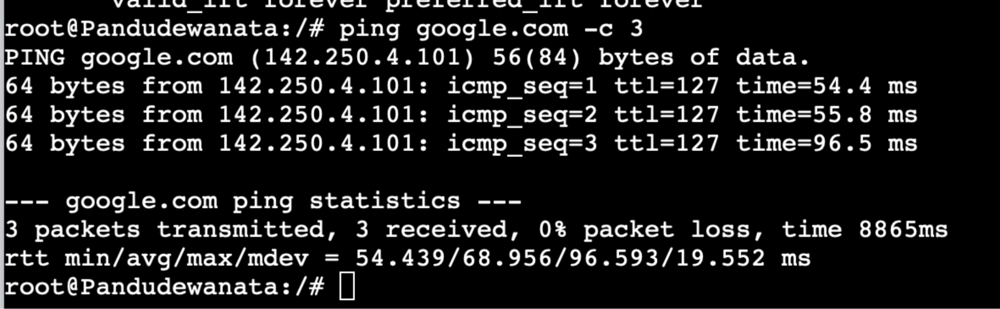
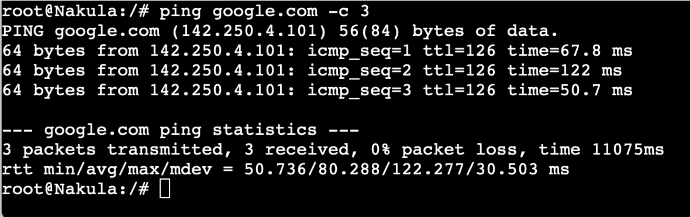
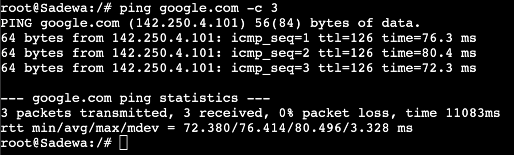
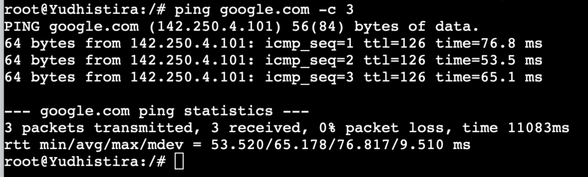
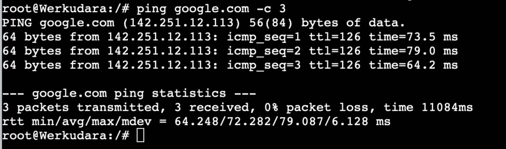


# No. 2
## Question
> Buatlah website utama pada node arjuna dengan akses ke arjuna.yyy.com dengan alias www.arjuna.yyy.com dengan yyy merupakan kode kelompok.

## Solution
- Node Yudhistira
```
nano /etc/bind/named.conf.local
```
Add some changes into the file like this:
```
zone "arjuna.I05.com" {
        type master;
        file "/etc/bind/jarkom/arjuna.I05.com";
};
```
Then we run the command below on the console:
```
mkdir /etc/bind/jarkom
cp /etc/bind/db.local /etc/bind/jarkom/arjuna.I05.com
nano /etc/bind/jarkom/arjuna.I05.com
```
Add some changes into the **arjuna.I05.com** file like this:
```
;
; BIND data file for local loopback interface
;
$TTL    604800
@       IN      SOA     arjuna.I05.com. root.arjuna.I05.com. (
                     2022100601         ; Serial
                         604800         ; Refresh
                          86400         ; Retry
                        2419200         ; Expire
                         604800 )       ; Negative Cache TTL
;
@       IN      NS      arjuna.I05.com.
@       IN      A       10.61.2.2
www     IN      CNAME   arjuna.I05.com.
```
Then we restart the bind using the following code:
```
service bind9 restart
```
To test whether it works or not, we run these commands on Nakula (or Sadewa):

```
ping arjuna.I05.com -c 3
ping www.arjuna.I05.com -c 3
```
- With www
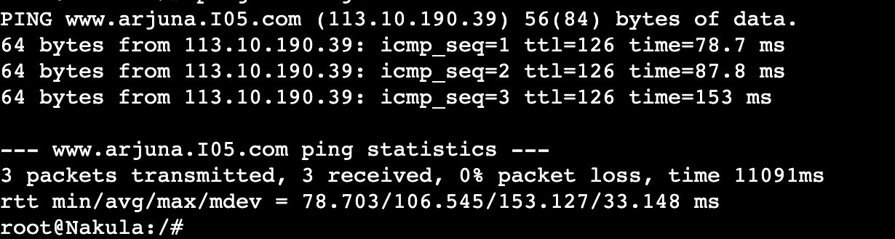

- Without www
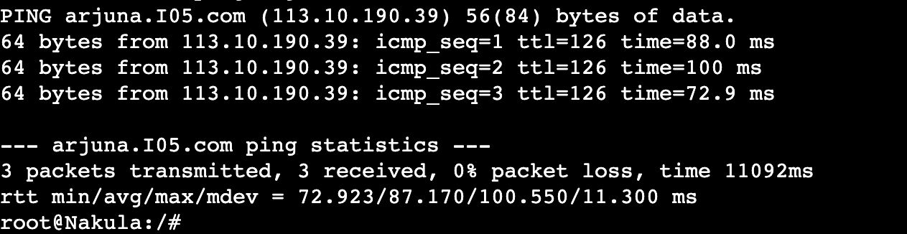

# No. 3
## Question
> Dengan cara yang sama seperti soal nomor 2, buatlah website utama dengan akses ke abimanyu.yyy.com dan alias www.abimanyu.yyy.com.

## Solution
- Node Yudhistira
```
nano /etc/bind/named.conf.local
```
Add some changes into the file like this:
```
zone "abimanyu.I05.com" {
        type master;
        file "/etc/bind/jarkom/abimanyu.I05.com";
};
```
Then we run the command below on the console:
```
cp /etc/bind/db.local /etc/bind/jarkom/abimanyu.I05.com
nano /etc/bind/jarkom/abimanyu.I05.com
```
Add some changes into the **abimanyu.I05.com** file like this:
```
;
; BIND data file for local loopback interface
;
$TTL    604800
@       IN      SOA     abimanyu.I05.com. root.abimanyu.I05.com. (
                     2022100601         ; Serial
                         604800         ; Refresh
                          86400         ; Retry
                        2419200         ; Expire
                         604800 )       ; Negative Cache TTL
;
@               IN      NS      abimanyu.I05.com.
@               IN      A       10.61.2.2
www             IN      CNAME   abimanyu.I05.com.
```
Then we restart the bind using the following code:
```
service bind9 restart
```
To test whether it works or not, we run these commands on Nakula (or Sadewa):

```
ping abimanyu.I05.com -c 3
ping www.abimanyu.I05.com -c 3
```
- With www
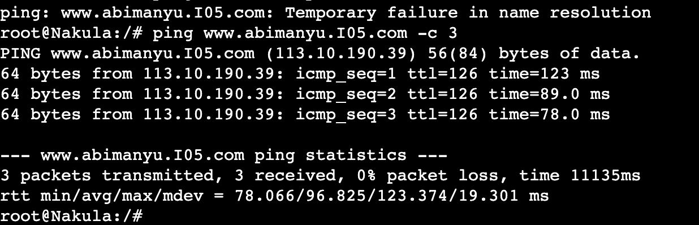

- Without www
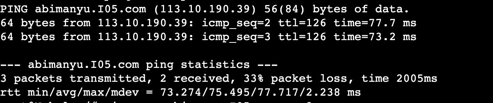

# No. 4
## Question
> Kemudian, karena terdapat beberapa web yang harus di-deploy, buatlah subdomain parikesit.abimanyu.yyy.com yang diatur DNS-nya di Yudhistira dan mengarah ke Abimanyu.

## Solution
- Node Yudhistira
```
nano /etc/bind/jarkom/abimanyu.I05.com
```
Then make some changes on the **abimanyu.I05.com** file like this:

```
;
; BIND data file for local loopback interface
;
$TTL    604800
@       IN      SOA     abimanyu.I05.com. root.abimanyu.I05.com. (
                     2022100601         ; Serial
                         604800         ; Refresh
                          86400         ; Retry
                        2419200         ; Expire
                         604800 )       ; Negative Cache TTL
;
@               IN      NS      abimanyu.I05.com.
@               IN      A       10.61.2.2
www             IN      CNAME   abimanyu.I05.com.
parikesit       IN      A       10.61.3.3
```
Then we run this commands on the Yudhistira console to restart the bind:
```
service bind9 restart
```
And then we run this command on Nakula (or Sadewa) to see if it works:
```
ping parikesit.abimanyu.I05.com -c 3
```
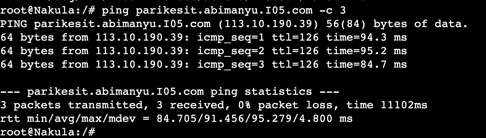

# No. 5
## Question
> Buat juga reverse domain untuk domain utama. (Abimanyu saja yang direverse)
## Solution
- Node Yudhistira
edit file /etc/bind/named.conf.local
```
nano /etc/bind/named.conf.local

```
Then add the following configuration to file named.conf.local
```
zone "3.61.10.in-addr.arpa" {
    type master;
    file "/etc/bind/jarkom/3.61.10.in-addr.arpa";
};
```
copy file to the db.local in path /etc/bind inside jarkom folder and rename to 3.61.10.in-addr.arpa which The first 3 bytes of the IP Abimanyu reversed in order of writing.
```
cp /etc/bind/db.local /etc/bind/jarkom/3.61.10.in-addr.arpa
```
edit file /etc/bind/jarkom/3.61.10.in-addr.arpa
```
nano /etc/bind/jarkom/3.61.10.in-addr.arpa
```
```
;
; BIND data file for local loopback interface
;
$TTL    604800
@       IN      SOA     abimanyu.I05.com. root.abimanyu.I05.com. (
                     2022100601         ; Serial
                         604800         ; Refresh
                          86400         ; Retry
                        2419200         ; Expire
                         604800 )       ; Negative Cache TTL
;
3.61.10.in-addr.arpa.   IN      NS      abimanyu.I05.com.
3                       IN      PTR     abimanyu.I05.com.

```
then restart bind9
```
service bind9 restart
```
- Node Nakula
To check whether the configuration is correct or not, execute the following command in node Nakula
```
apt-get update
apt-get install dnsutils

host -t PTR 10.61.3.3
```


# No. 6
## Question
> Agar dapat tetap dihubungi ketika DNS Server Yudhistira bermasalah, buat juga Werkudara sebagai DNS Slave untuk domain utama.
## Solution
- Node Yudhistira
edit file /etc/bind/named.conf.local in node Yudhistira
```
nano /etc/bind/named.conf.local
```
```
zone "arjuna.I05.com" {
        type master;
        notify yes;
        also-notify { 10.61.2.3; }; // Masukan IP Werkudara
        allow-transfer { 10.61.2.3; }; // Masukan IP Werkudara
        file "/etc/bind/jarkom/arjuna.I05.com";
};

zone "abimanyu.I05.com" {
        type master;
        notify yes;
        also-notify { 10.61.2.3; }; // Masukan IP Werkudara
        allow-transfer { 10.61.2.3; }; // Masukan IP Werkudara
        file "/etc/bind/jarkom/abimanyu.I05.com";
};
```
then restart bind9
```
service bind9 restart
```

- Node Werkudara
Run these commands
```
apt-get update
apt-get install bind9 -y
```
edit file /etc/bind/named.conf.local 
```
//
// Do any local configuration here
//

// Consider adding the 1918 zones here, if they are not used in your
// organization
//include "/etc/bind/zones.rfc1918";

zone "arjuna.I05.com" {
    type slave;
    masters { 10.61.2.2; }; // Masukan IP Yudhistira
    file "/var/lib/bind/arjuna.I05.com";
};

zone "abimanyu.I05.com" {
    type slave;
    masters { 10.61.2.2; }; // Masukan IP Yudhistira
    file "/var/lib/bind/abimanyu.I05.com";
};
```
then restart bind9
```
service bind9 restart
```
then stop bind9 in node Yudhistira
```
service bind9 stop
```
- Node Nakula
and try to ping abimanyu.I05.com
```
ping abimanyu.I05.com
```

# No. 7
## Question
> Seperti yang kita tahu karena banyak sekali informasi yang harus diterima, buatlah subdomain khusus untuk perang yaitu baratayuda.abimanyu.yyy.com dengan alias www.baratayuda.abimanyu.yyy.com yang didelegasikan dari Yudhistira ke Werkudara dengan IP menuju ke Abimanyu dalam folder Baratayuda.
## Solution
edit /etc/bind/jarkom/abimanyu.I05.com in node Yudhistira
- Node Yudhistira
```
nano /etc/bind/jarkom/abimanyu.I05.com
```
```
;
; BIND data file for local loopback interface
;
$TTL    604800
@       IN      SOA     abimanyu.I05.com. root.abimanyu.I05.com. (
                     2022100601         ; Serial
                         604800         ; Refresh
                          86400         ; Retry
                        2419200         ; Expire
                         604800 )       ; Negative Cache TTL
;
@               IN      NS      abimanyu.I05.com.
@               IN      A       10.61.2.2
www             IN      CNAME   abimanyu.I05.com.
parikesit       IN      A       10.61.3.3
ns1             IN      A       10.61.2.3
baratayuda      IN      NS      ns1
```
then restart bind9
```
service bind9 restart
```

- Werkudara
edit /etc/bind/named.conf.local
```
nano /etc/bind/named.conf.local
```
```
zone "baratayuda.abimanyu.I05.com" {
    type master;
    file "/etc/bind/baratayuda/baratayuda.abimanyu.I05.com";
};
```
make a folder baratayuda for baratayuda.abimanyu.I05.com
```
mkdir /etc/bind/baratayuda
```
then edit /etc/bind/baratayuda/baratayuda.abimanyu.I05.com as follow
```
nano /etc/bind/baratayuda/baratayuda.abimanyu.I05.com
```
```
;
; BIND data file for local loopback interface
;
$TTL    604800
@       IN      SOA     baratayuda.abimanyu.I05.com. root.baratayuda.abimanyu.I$
                     2022100601         ; Serial
                         604800         ; Refresh
                          86400         ; Retry
                        2419200         ; Expire
                         604800 )       ; Negative Cache TTL
;
@       IN      NS      baratayuda.abimanyu.I05.com.
@       IN      A       10.61.3.3
www     IN      CNAME   baratayuda.abimanyu.I05.com.
```
then restart bind9
```
service bind9 restart
```
- Node Nakula
try to ping baratayuda.abimanyu.I05.com or ping www.baratayuda.I05.com in node Nakula
```
ping baratayuda.abimanyu.I05.com

OR

ping www.baratayuda.abimanyu.I05.com
```
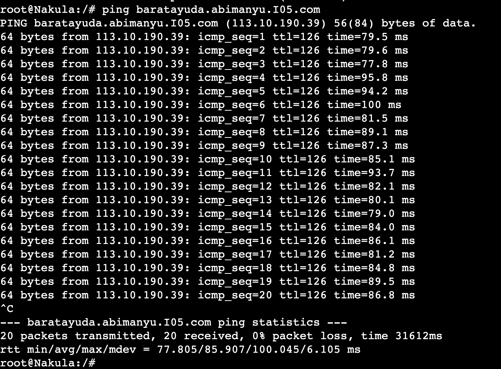
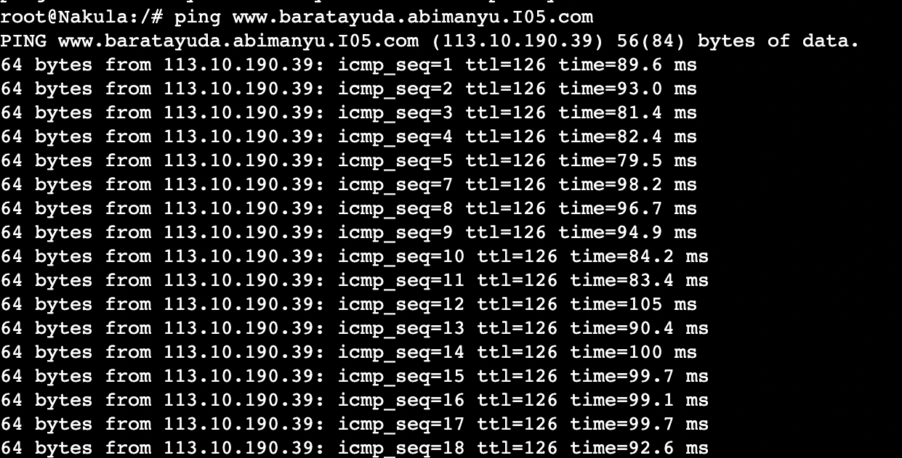


# No. 8
## Question
> Untuk informasi yang lebih spesifik mengenai Ranjapan Baratayuda, buatlah subdomain melalui Werkudara dengan akses rjp.baratayuda.abimanyu.yyy.com dengan alias www.rjp.baratayuda.abimanyu.yyy.com yang mengarah ke Abimanyu.
## Solution
- Node Werkudara
```
nano /etc/bind/baratayuda/baratayuda.abimanyu.I05.com
```
```
;
; BIND data file for local loopback interface
;
$TTL    604800
@       IN      SOA     baratayuda.abimanyu.I05.com. root.baratayuda.abimanyu.I$
                     2022100601         ; Serial
                         604800         ; Refresh
                          86400         ; Retry
                        2419200         ; Expire
                         604800 )       ; Negative Cache TTL
;
@       IN      NS      baratayuda.abimanyu.I05.com.
@       IN      A       10.61.3.3
www     IN      CNAME   baratayuda.abimanyu.I05.com.
rjp     IN      A       10.61.3.3
www.rjp IN      CNAME   rjp.baratayuda.abimanyu.I05.com.
```
```
service bind9 restart
```
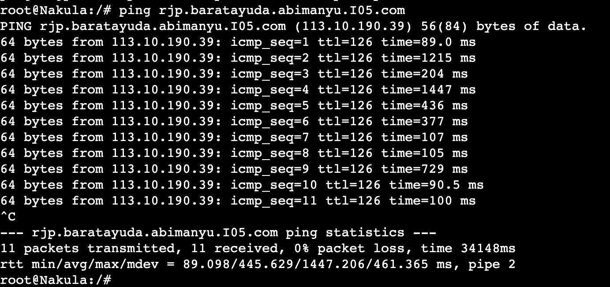
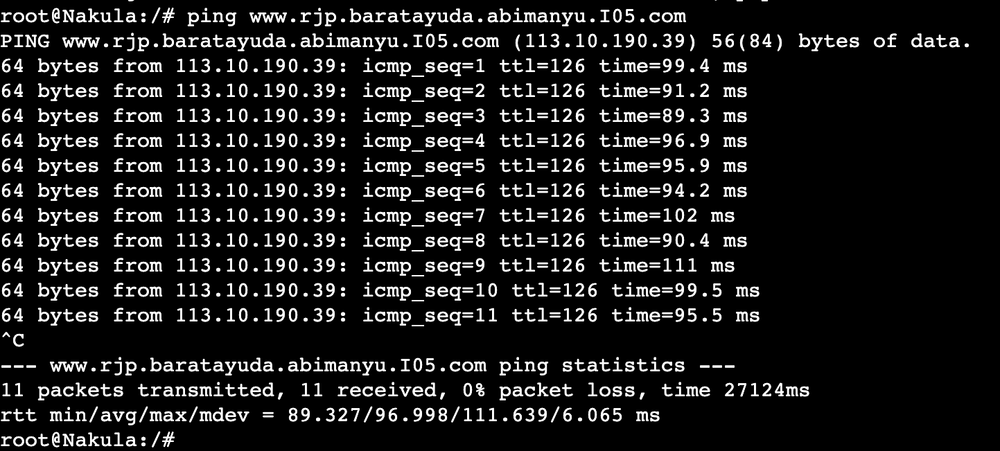


# No. 9
## Question
> Arjuna merupakan suatu Load Balancer Nginx dengan tiga worker (yang juga menggunakan nginx sebagai webserver) yaitu Prabakusuma, Abimanyu, dan Wisanggeni. Lakukan deployment pada masing-masing worker.
## Solution
To set up a load balancer, we can configure the Arjuna node as the load balancer, and the nodes: Prabakusuma, Abimanyu, and Wisanggeni as its workers. This configuration can be put into a single bash script, but differentiated for each of their functions.

- Node Arjuna

On the Arjuna node, you can perform the following configuration (Some commands have been previously mentioned in the Preparation section, but are reiterated here).

```
apt-get update
apt-get install bind9 nginx
apt-get install dnsutils -y
apt-get install lynx -y
```

After that, for the load balancer on the Arjuna node, it can be set up through the following configuration.

```
echo '
 upstream myweb  {
 	server 10.61.3.2; #IP Prabakusuma
 	server 10.61.3.3; #IP Abimanyu
 	server 10.61.3.4; #IP Wisanggeni
 }

 server {
 	listen 80;
 	server_name arjuna.I05.com www.arjuna.I05.com;

 	location / {
 	proxy_pass http://myweb;
 	}
 }
' > /etc/nginx/sites-available/lb-arjuna.I05

 ln -s /etc/nginx/sites-available/lb-arjuna.I05 /etc/nginx/sites-enabled
 service nginx restart
```


- Node Prabukusuma

For the worker node, on the Prabakusuma node, perform the following configuration.

```
echo -e '
nameserver 192.168.122.1
nameserver 10.61.2.2 # IP Yudhistira
nameserver 10.61.2.3 # IP Werkudara
' > /etc/resolv.conf
apt-get update && apt install nginx php php-fpm -y
php -v
apt-get install lynx -y
apt-get install dnsutils -y

mkdir /var/www/praktikum-jarkom

echo '
 <?php
  echo "Halo, Kamu berada di Prabakusuma";
 ?>
' > /var/www/praktikum-jarkom/index.php

echo '
 server {

 	listen 80;

 	root /var/www/praktikum-jarkom;

 	index index.php index.html index.htm;
 	server_name _;

 	location / {
 			try_files $uri $uri/ /index.php?$query_string;
 	}

 	# pass PHP scripts to FastCGI server
 	location ~ \.php$ {
 	include snippets/fastcgi-php.conf;
 	fastcgi_pass unix:/var/run/php/php7.0-fpm.sock;
 	}

 location ~ /\.ht {
 			deny all;
 	}

 	error_log /var/log/nginx/arjuna.I05_error.log;
 	access_log /var/log/nginx/arjuna.I05_access.log;
 }
' > /etc/nginx/sites-available/arjuna.I05

ln -s /etc/nginx/sites-available/arjuna.I05 /etc/nginx/sites-enabled
service php7.0-fpm start
rm /etc/nginx/sites-enabled/default
service nginx restart
```

- Node Abimanyu

For the worker node, on the Abimanyu node, perform the following configuration.

```
echo -e '
nameserver 192.168.122.1
nameserver 10.61.2.2 # IP Yudhistira
nameserver 10.61.2.3 # IP Werkudara
' > /etc/resolv.conf
apt-get update && apt install nginx php php-fpm -y
php -v
apt-get install lynx -y
apt-get install dnsutils -y

mkdir /var/www/praktikum-jarkom

echo '
 <?php
  echo "Halo, Kamu berada di Abimanyu";
 ?>
' > /var/www/praktikum-jarkom/index.php

echo '
 server {

 	listen 80;

 	root /var/www/praktikum-jarkom;

 	index index.php index.html index.htm;
 	server_name _;

 	location / {
 			try_files $uri $uri/ /index.php?$query_string;
 	}

 	# pass PHP scripts to FastCGI server
 	location ~ \.php$ {
 	include snippets/fastcgi-php.conf;
 	fastcgi_pass unix:/var/run/php/php7.0-fpm.sock;
 	}

 location ~ /\.ht {
 			deny all;
 	}

 	error_log /var/log/nginx/arjuna.I05_error.log;
 	access_log /var/log/nginx/arjuna.I05_access.log;
 }
' > /etc/nginx/sites-available/arjuna.I05

ln -s /etc/nginx/sites-available/arjuna.I05 /etc/nginx/sites-enabled
service php7.0-fpm start
rm /etc/nginx/sites-enabled/default
service nginx restart
```
- Node Wisanggani

For the worker node, on the Wisanggeni node, perform the following configuration.

```
echo -e '
nameserver 192.168.122.1
nameserver 10.61.2.2 # IP Yudhistira
nameserver 10.61.2.3 # IP Werkudara
' > /etc/resolv.conf
apt-get update && apt install nginx php php-fpm -y
php -v
apt-get install lynx -y
apt-get install dnsutils -y

mkdir /var/www/praktikum-jarkom

echo '
 <?php
  echo "Halo, Kamu berada di Wisanggeni";
 ?>
' > /var/www/praktikum-jarkom/index.php

echo '
 server {

 	listen 80;

 	root /var/www/praktikum-jarkom;

 	index index.php index.html index.htm;
 	server_name _;

 	location / {
 			try_files $uri $uri/ /index.php?$query_string;
 	}

 	# pass PHP scripts to FastCGI server
 	location ~ \.php$ {
 	include snippets/fastcgi-php.conf;
 	fastcgi_pass unix:/var/run/php/php7.0-fpm.sock;
 	}

 location ~ /\.ht {
 			deny all;
 	}

 	error_log /var/log/nginx/arjuna.I05_error.log;
 	access_log /var/log/nginx/arjuna.I05_access.log;
 }
' > /etc/nginx/sites-available/arjuna.I05

ln -s /etc/nginx/sites-available/arjuna.I05 /etc/nginx/sites-enabled
service php7.0-fpm start
rm /etc/nginx/sites-enabled/default
service nginx restart
```

# No. 10
## Question
> Kemudian gunakan algoritma Round Robin untuk Load Balancer pada Arjuna. Gunakan server_name pada soal nomor 1. Untuk melakukan pengecekan akses alamat web tersebut kemudian pastikan worker yang digunakan untuk menangani permintaan akan berganti ganti secara acak. Untuk webserver di masing-masing worker wajib berjalan di port 8001-8003. Contoh: **Prabakusuma:8001, Abimanyu:8002, Wisanggeni:8003**
## Solution
To configure the Arjuna load balancer, you can modify the configuration as follows. Here, :800N is added to each line of its worker servers, with N representing numbers 1 to 3 to differentiate the ports for each worker.

```
echo '
 upstream myweb  {
 	server 10.61.3.2:8001; #IP Prabakusuma
 	server 10.61.3.3:8002; #IP Abimanyu
 	server 10.61.3.4:8003; #IP Wisanggeni
 }

 server {
 	listen 80;
 	server_name arjuna.I05.com;

 	location / {
 	proxy_pass http://myweb;
 	}
 }
' > /etc/nginx/sites-available/lb-arjuna.I05
ln -s /etc/nginx/sites-available/lb-arjuna.I05 /etc/nginx/sites-enabled
service nginx restart
```


As for the workers, there is additional information regarding the ports they use. In this configuration, you can see it in the line ```listen 800N```, where N corresponds to the port number for each worker. Additionally, one ```echo``` command (the third echo) is added to display an additional message about the port used by each worker.

```
echo '
 <?php
  echo "Halo, Kamu berada di [Nama Worker]";
 ?>
' > /var/www/praktikum-jarkom/index.php

echo '
server {

 	listen 800N;

 	root /var/www/praktikum-jarkom;

 	index index.php index.html index.htm;
 	server_name _;

 	location / {
 			try_files $uri $uri/ /index.php?$query_string;
 	}

 	# pass PHP scripts to FastCGI server
 	location ~ \.php$ {
 	include snippets/fastcgi-php.conf;
 	fastcgi_pass unix:/var/run/php/php7.0-fpm.sock;
 	}

location ~ /\.ht {
 			deny all;
 	}

 	error_log /var/log/nginx/arjuna.I05_error.log;
 	access_log /var/log/nginx/arjuna.I05_access.log;
 }
' > /etc/nginx/sites-available/arjuna.I05

nginx_port=$(awk '/listen/ {print $2}' /etc/nginx/sites-available/arjuna.I05)
echo "
 <?php
  echo ',tepatnya di port : $nginx_port'
 ?>
" >> /var/www/praktikum-jarkom/index.php

service php7.0-fpm start
rm /etc/nginx/sites-enabled/default
service nginx restart
```

# No. 11
## Question
> Selain menggunakan Nginx, lakukan konfigurasi Apache Web Server pada worker Abimanyu dengan web server www.abimanyu.yyy.com. Pertama dibutuhkan web server dengan DocumentRoot pada /var/www/abimanyu.yyy
## Solution
- Node Abimanyu

We will need several setup configurations if we haven't set up the Abimanyu node yet, as follows

```
apt-get update
apt-get install apache2 -y
apt-get install libapache2-mod-php7.0 -y
service apache2 start
apt-get install wget -y
apt-get install unzip -y
apt-get install php -y
```

then, run these commands

```
wget -O '/var/www/abimanyu.I05.com' 'https://drive.usercontent.google.com/download?id=1a4V23hwK9S7hQEDEcv9FL14UkkrHc-Zc'
unzip -o /var/www/abimanyu.I05.com -d /var/www/
mv /var/www/abimanyu.yyy.com /var/www/abimanyu.I05
rm /var/www/abimanyu.I05.com
rm -rf /var/www/abimanyu.yyy.com
```

- Node Abimanyu

```
cp /etc/apache2/sites-available/000-default.conf /etc/apache2/sites-available/abimanyu.I05.com.conf

rm /etc/apache2/sites-available/000-default.conf

echo -e '<VirtualHost *:80>
  ServerAdmin webmaster@localhost
  DocumentRoot /var/www/abimanyu.I05

  ServerName abimanyu.I05.com
  ServerAlias www.abimanyu.I05.com

  ErrorLog ${APACHE_LOG_DIR}/error.log
  CustomLog ${APACHE_LOG_DIR}/access.log combined
</VirtualHost>' > /etc/apache2/sites-available/abimanyu.I05.com.conf

a2ensite abimanyu.I05.com.conf

service apache2 restart
```

Then, to display it on the client, we can use the installed Lynx

```
apt-get install lynx -y
```

Afterward, run it directly with the following command.

```
lynx abimanyu.I05.com
```

# No. 12
## Question
> Setelah itu ubahlah agar url www.abimanyu.yyy.com/index.php/home menjadi www.abimanyu.yyy.com/home.
## Solution

To resolve this issue, you will need the ```Directory``` as a tool to rewrite Indexes in order to create an Alias for the domain. The implementation is as follows.

```
<Directory /var/www/abimanyu.I05/index.php/home>
  Options +Indexes
</Directory>

Alias "/home" "/var/www/abimanyu.I05/index.php/home"
```
- Node Abimanyu
```
echo -e '<VirtualHost *:80>
  ServerAdmin webmaster@localhost
  DocumentRoot /var/www/abimanyu.I05
  ServerName abimanyu.I05.com
  ServerAlias www.abimanyu.I05.com

  <Directory /var/www/abimanyu.I05/index.php/home>
          Options +Indexes
  </Directory>

  Alias "/home" "/var/www/abimanyu.I05/index.php/home"

  ErrorLog ${APACHE_LOG_DIR}/error.log
  CustomLog ${APACHE_LOG_DIR}/access.log combined
</VirtualHost>' > /etc/apache2/sites-available/abimanyu.I05.com.conf

service apache2 restart
```

running the following command on the Nakula or Sadewa Node.

- Node Nakula or Sadewa
```
lynx abimanyu.I05.com/home
```
# No. 13
## Question
> Selain itu, pada subdomain www.parikesit.abimanyu.yyy.com, DocumentRoot disimpan pada /var/www/parikesit.abimanyu.yyy
## Solution

In addressing this issue, we initially need several setup configurations as follows:

```
wget -O '/var/www/parikesit.abimanyu.I05.com' 'https://drive.usercontent.google.com/download?id=1LdbYntiYVF_NVNgJis1GLCLPEGyIOreS'
unzip -o /var/www/parikesit.abimanyu.I05.com -d /var/www/
mv /var/www/parikesit.abimanyu.yyy.com /var/www/parikesit.abimanyu.I05
rm /var/www/parikesit.abimanyu.I05.com
rm -rf /var/www/parikesit.abimanyu.yyy.com
mkdir /var/www/parikesit.abimanyu.I05/secret
```

Followed by configuring the ```ServerName``` and ```ServerAlias```.

```
echo -e '<VirtualHost *:80>
  ServerAdmin webmaster@localhost
  DocumentRoot /var/www/parikesit.abimanyu.I05
  ServerName parikesit.abimanyu.I05.com
  ServerAlias www.parikesit.abimanyu.I05.com

  ErrorLog ${APACHE_LOG_DIR}/error.log
  CustomLog ${APACHE_LOG_DIR}/access.log combined
</VirtualHost>' > /etc/apache2/sites-available/parikesit.abimanyu.I05.com.conf

a2ensite parikesit.abimanyu.I05.com.conf

service apache2 restart
```
Then, to verify it, enter the following command on the Nakula or Sadewa Node.

```
lynx parikesit.abimanyu.I05.com
```

# No. 14
## Question
> Pada subdomain tersebut folder /public hanya dapat melakukan directory listing sedangkan pada folder /secret tidak dapat diakses (403 Forbidden)
## Solution
In addressing this issue, it's quite simple. The principle is that to allow the public to perform directory listing, we use 'Options +Indexes.' On the other hand, to forbid access to a folder, we can use 'Options -Indexes.
- Node Abimanyu
```
echo -e '<VirtualHost *:80>
  ServerAdmin webmaster@localhost
  DocumentRoot /var/www/parikesit.abimanyu.I05
  ServerName parikesit.abimanyu.I05.com
  ServerAlias www.parikesit.abimanyu.I05.com

  <Directory /var/www/parikesit.abimanyu.I05/public>
          Options +Indexes
  </Directory>

  <Directory /var/www/parikesit.abimanyu.I05/secret>
          Options -Indexes
  </Directory>

  Alias "/public" "/var/www/parikesit.abimanyu.I05/public"
  Alias "/secret" "/var/www/parikesit.abimanyu.I05/secret"

  ErrorLog ${APACHE_LOG_DIR}/error.log
  CustomLog ${APACHE_LOG_DIR}/access.log combined
</VirtualHost>' > /etc/apache2/sites-available/parikesit.abimanyu.I05.com.conf

service apache2 restart
```

Then, to verify it, enter the following command on the Nakula or Sadewa Node.

```
lynx parikesit.abimanyu.I05.com/public
lynx parikesit.abimanyu.I05.com/secret
```


# No. 15
## Question
> Buatlah kustomisasi halaman error pada folder /error untuk mengganti error kode pada Apache. Error kode yang perlu diganti adalah 404 Not Found dan 403 Forbidden.

## Solution
Add 2 error lines to the **parikesit.abimanyu.I05.com.conf** file:
```
ErrorDocument 404 /error/404.html
ErrorDocument 403 /error/403.html
```

- On the Abimanyu node
```
echo -e '<VirtualHost *:80>
  ServerAdmin webmaster@localhost
  DocumentRoot /var/www/parikesit.abimanyu.I05
  ServerName parikesit.abimanyu.I05.com
  ServerAlias www.parikesit.abimanyu.I05.com

  <Directory /var/www/parikesit.abimanyu.I05/public>
          Options +Indexes
  </Directory>

  <Directory /var/www/parikesit.abimanyu.I05/secret>
          Options -Indexes
  </Directory>

  Alias "/public" "/var/www/parikesit.abimanyu.I05/public"
  Alias "/secret" "/var/www/parikesit.abimanyu.I05/secret"

  ErrorDocument 404 /error/404.html
  ErrorDocument 403 /error/403.html

  ErrorLog ${APACHE_LOG_DIR}/error.log
  CustomLog ${APACHE_LOG_DIR}/access.log combined
</VirtualHost>' > /etc/apache2/sites-available/parikesit.abimanyu.I05.com.conf

service apache2 restart
```
To prove the custom error, we need to run these commands on the Client node:
```
lynx parikesit.abimanyu.I05.com/testerror
lynx parikesit.abimanyu.I05.com/secret
```


# No. 16
## Question
> Buatlah suatu konfigurasi virtual host agar file asset www.parikesit.abimanyu.yyy.com/public/js menjadi 
www.parikesit.abimanyu.yyy.com/js

## Solution
On file parikesit.abimanyu.I05.com.conf add an Alias line "/js" "/var/www/parikesit.abimanyu.I05/public/js" like this:
```
echo -e '<VirtualHost *:80>
  ServerAdmin webmaster@localhost
  DocumentRoot /var/www/parikesit.abimanyu.I05
  ServerName parikesit.abimanyu.I05.com
  ServerAlias www.parikesit.abimanyu.I05.com

  <Directory /var/www/parikesit.abimanyu.I05/public>
          Options +Indexes
  </Directory>

  <Directory /var/www/parikesit.abimanyu.I05/secret>
          Options -Indexes
  </Directory>

  Alias "/public" "/var/www/parikesit.abimanyu.I05/public"
  Alias "/secret" "/var/www/parikesit.abimanyu.I05/secret"
  Alias "/js" "/var/www/parikesit.abimanyu.I05/public/js"

  ErrorDocument 404 /error/404.html
  ErrorDocument 403 /error/403.html

  ErrorLog ${APACHE_LOG_DIR}/error.log
  CustomLog ${APACHE_LOG_DIR}/access.log combined
</VirtualHost>' > /etc/apache2/sites-available/parikesit.abimanyu.I05.com.conf
```
and then restart the apache2 by running the command:
```
service apache2 restart
```

# No. 17
## Question
> Agar aman, buatlah konfigurasi agar www.rjp.baratayuda.abimanyu.yyy.com hanya dapat diakses melalui port 14000 dan 14400.

## Solution
After downloading from the drive, we can add ```<VirtualHost *:14000 *:14400>``` to virtual host by making configuration on file ```/etc/apache2/sites-available/rjp.baratayuda.abimanyu.I05.com.conf``` like this:
```
echo -e '<VirtualHost *:14000 *:14400>
  ServerAdmin webmaster@localhost
  DocumentRoot /var/www/rjp.baratayuda.abimanyu.I05
  ServerName rjp.baratayuda.abimanyu.I05.com
  ServerAlias www.rjp.baratayuda.abimanyu.I05.com

  ErrorDocument 404 /error/404.html
  ErrorDocument 403 /error/403.html

  ErrorLog ${APACHE_LOG_DIR}/error.log
  CustomLog ${APACHE_LOG_DIR}/access.log combined
</VirtualHost>' > /etc/apache2/sites-available/rjp.baratayuda.abimanyu.I05.com.conf
```
Then we need to add a **Listening Port** to file ```/etc/apache2/ports.conf```, like this:
```
echo -e '# If you just change the port or add more ports here, you will likely also
# have to change the VirtualHost statement in
# /etc/apache2/sites-enabled/000-default.conf

Listen 80
Listen 14000
Listen 14400

<IfModule ssl_module>
        Listen 443
</IfModule>

<IfModule mod_gnutls.c>
        Listen 443
</IfModule>

# vim: syntax=apache ts=4 sw=4 sts=4 sr noet' > /etc/apache2/ports.conf
```
Then, we have to activate and restart the Apache2 server
```
a2ensite rjp.baratayuda.abimanyu.I05.com.conf
service apache2 restart
```

# No. 18
## Question
> Untuk mengaksesnya buatlah autentikasi username berupa “Wayang” dan password “baratayudayyy” dengan yyy merupakan kode kelompok. Letakkan DocumentRoot pada /var/www/rjp.baratayuda.abimanyu.yyy.

## Solution
Add settings like ```AuthType, AuthName, AuthUserFile, dan Require valid-user``` on the ```<Directory /x> ... </Directory>``` inside ```/etc/apache2/sites-available/rjp.baratayuda.abimanyu.I05.com.conf``` file like this:
```
echo -e '<VirtualHost *:14000 *:14400>
  ServerAdmin webmaster@localhost
  DocumentRoot /var/www/rjp.baratayuda.abimanyu.I05
  ServerName rjp.baratayuda.abimanyu.I05.com
  ServerAlias www.rjp.baratayuda.abimanyu.I05.com

  <Directory /var/www/rjp.baratayuda.abimanyu.I05>
          AuthType Basic
          AuthName "Restricted Content"
          AuthUserFile /etc/apache2/.htsecure
          Require valid-user
  </Directory>

  ErrorDocument 404 /error/404.html
  ErrorDocument 403 /error/403.html

  ErrorLog ${APACHE_LOG_DIR}/error.log
  CustomLog ${APACHE_LOG_DIR}/access.log combined
</VirtualHost>' > /etc/apache2/sites-available/rjp.baratayuda.abimanyu.I05.com.conf
```
After that, we can run this command:
```
htpasswd -c -b /etc/apache2/.htsecure Wayang baratayudaI05
```
And then we can activate and restart the Apache2 server
```
a2ensite rjp.baratayuda.abimanyu.I05.com.conf
service apache2 restart
```

# No. 19
## Question
> Buatlah agar setiap kali mengakses IP dari Abimanyu akan secara otomatis dialihkan ke www.abimanyu.yyy.com (alias)

## Solution
To do this question, we need to add ```Redirect``` to www.abimanyu.I05.com. We can add this configuration to ```000-default.conf``` .

```
echo -e '<VirtualHost *:80>
    ServerAdmin webmaster@abimanyu.I05.com
    DocumentRoot /var/www/html

    ErrorLog ${APACHE_LOG_DIR}/error.log
    CustomLog ${APACHE_LOG_DIR}/access.log combined

    Redirect / http://www.abimanyu.I05.com/
</VirtualHost>' > /etc/apache2/sites-available/000-default.conf

apache2ctl configtest

service apache2 restart
```

# No. 20
## Question
> Karena website www.parikesit.abimanyu.yyy.com semakin banyak pengunjung dan banyak gambar gambar random, maka ubahlah request gambar yang memiliki substring “abimanyu” akan diarahkan menuju abimanyu.png.

## Solution
To answer this question, we need to set the URL mapping with the help of ```a2enmod rewrite```.

First we need to run this command:
```
a2enmod rewrite
```
After that, we carry out the settings for the Rewrite conditions, like this:
```
echo 'RewriteEngine On
RewriteCond %{REQUEST_URI} ^/public/images/(.*)(abimanyu)(.*\.(png|jpg))
RewriteCond %{REQUEST_URI} !/public/images/abimanyu.png
RewriteRule abimanyu http://parikesit.abimanyu.I05.com/public/images/abimanyu.png$1 [L,R=301]' > /var/www/parikesit.abimanyu.I05/.htaccess
```
After that there is a virtual host configuration as follows:

```
echo -e '<VirtualHost *:80>
  ServerAdmin webmaster@localhost
  DocumentRoot /var/www/parikesit.abimanyu.I05

  ServerName parikesit.abimanyu.I05.com
  ServerAlias www.parikesit.abimanyu.I05.com

  <Directory /var/www/parikesit.abimanyu.I05/public>
          Options +Indexes
  </Directory>

  <Directory /var/www/parikesit.abimanyu.I05/secret>
          Options -Indexes
  </Directory>

  <Directory /var/www/parikesit.abimanyu.I05>
          Options +FollowSymLinks -Multiviews
          AllowOverride All
  </Directory>

  Alias "/public" "/var/www/parikesit.abimanyu.I05/public"
  Alias "/secret" "/var/www/parikesit.abimanyu.I05/secret"
  Alias "/js" "/var/www/parikesit.abimanyu.I05/public/js"

  ErrorDocument 404 /error/404.html
  ErrorDocument 403 /error/403.html

  ErrorLog ${APACHE_LOG_DIR}/error.log
  CustomLog ${APACHE_LOG_DIR}/access.log combined
</VirtualHost>' > /etc/apache2/sites-available/parikesit.abimanyu.I05.com.conf
```
Last, we need to run this command:
```
a2enmod rewrite
service apache2 restart
```
# Obstacle
- No 9 is pretty confusing, so we were stuck on that number.
